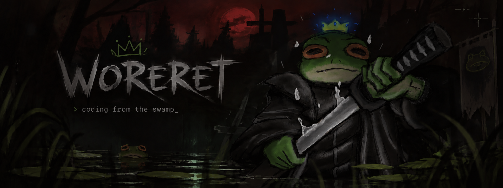

<p align="center">
  
</p>

## `$ whoami`

```text
Yehor
├─ backend → TypeScript / Node.js
├─ db      → PostgreSQL
├─ os      → Windows/Arch
└─ editor  → Vs/Zed
```

## ⚔️ Current quest

### [user-car-management-api](https://github.com/Woreret/user-car-management-api)

REST API for users and their cars.

`TypeScript` `Node.js` `Express` `PostgreSQL` `JWT` `Zod`

Currently working on tests, Docker and deployment.

## 🌿 Stuff I use

```text
languages    TypeScript · JavaScript · HTML/CSS
backend      Node.js · Express
database     PostgreSQL
tools        Git · Bruno · Zed
system       Arch Linux · Windows
```

## 🐸 The swamp

<p align="center">
  
</p>

<p align="center">
  
</p>
